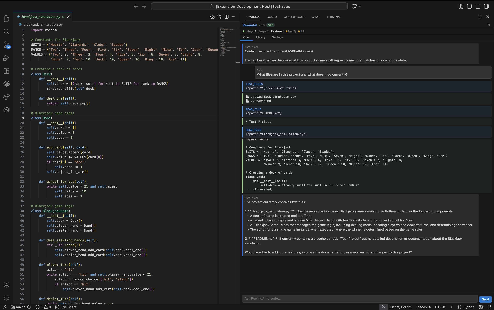
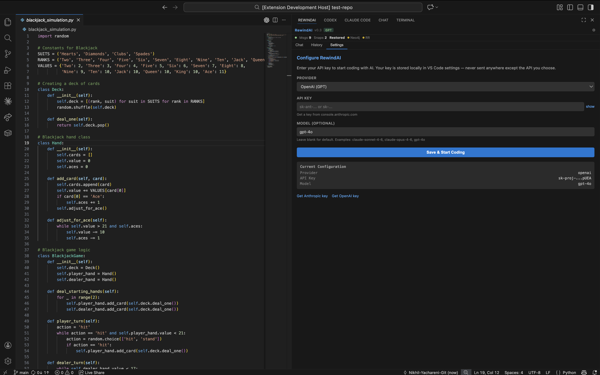

<div align="center">


# RewindAI

### Git for AI Memory

**Your AI coding agent's context is version-controlled.** Chat, commit, checkout — the agent remembers.

[](https://code.visualstudio.com/)
[](https://neo4j.com/)
[](https://rocketride.org/)
[](https://www.typescriptlang.org/)

*Built at [HackwithBay 2.0](https://luma.com/2n8vk5s3?tk=N8NtoT) by [Nikhil Yachareni](https://github.com/nickleodoen) & [Mihir Modi](https://github.com/wdwd720)*

[](https://youtu.be/kCTigOCKV1s)

---

</div>

<div align="center">

[](https://youtu.be/kCTigOCKV1s)

**[Watch the full demo on YouTube →](https://youtu.be/kCTigOCKV1s)**

</div>

## The Problem

Every developer using AI coding agents (Claude Code, Cursor, Copilot) has this problem:

> You come back to code you wrote with AI help a week ago, and the agent has **zero memory** of why those decisions were made.

Git tells you **what** changed. But not **what the AI was thinking** or **what context led to those changes**.

## The Solution

RewindAI makes git commits carry their AI context.

- **Chat** with an AI coding agent in VS Code — it reads, writes, and edits your files
- **Commit** — the agent's full context (conversation, decisions, file changes) is automatically saved
- **Checkout** a previous commit — the agent is restored to exactly what it knew at that point
- **No hallucination** — the restored agent only sees stored context, nothing leaks in

<div align="center">

<br/>
<em>RewindAI in action — the agent reads files, analyzes code, and maintains version-controlled context across commits</em>
</div>

## How It Works

```text
┌─────────────────────────────────────────────────────────────┐
│              VS Code Extension (TypeScript)                 │
│                                                             │
│  ┌──────────────┐  ┌────────────┐  ┌──────────────────┐     │
│  │ RewindAI     │  │ Agentic    │  │ Git Watcher      │     │
│  │ Chat Panel   │  │ Loop       │  │ (auto-save on    │     │
│  │ (WebView)    │  │ (7 tools)  │  │ commit)          │     │
│  └──────┬───────┘  └─────┬──────┘  └────────-┬────────┘     │
│         │                │                   │              │
│  ┌──────┴────────────────┴───────────────────┴──────────┐   │
│  │                  Context Manager                     │   │
│  │ .rewind/snapshots/{sha}.json - per-commit            │   │
│  │ .rewind/sessions/*.md - per-prompt notes             │   │
│  │ _current_summary.md - rolling compacted context      │   │
│  └──────┬────────────────┬───────────────────┬──────────┘   │
└─────────┼────────────────┼───────────────────┼──────────────┘
          │                │                   │
   ┌──────┴──────┐   ┌─────┴──────┐    ┌───────┴────────┐
   │ Neo4j       │   │ Anthropic  │    │ RocketRide     │
   │ Knowledge   │   │ / OpenAI   │    │ AI Pipelines   │
   │ Graph       │   │ (user's    │    │ (extraction,   │
   │             │   │ API key)   │    │ compression)   │
   └─────────────┘   └────────────┘    └────────────────┘
```

### The Agentic Loop

RewindAI isn't just a chat. It's a full coding agent with 7 tools:

| Tool | What It Does |
|----------------|------------------------------------------------------|
| `read_file`    | Read any file in the workspace                       |
| `write_file`   | Create or overwrite files                            |
| `edit_file`    | Find-and-replace for targeted edits                  |
| `run_command`  | Execute shell commands (npm test, git status, etc.)  |
| `list_files`   | Explore the project structure                        |
| `search_files` | Grep across the codebase                             |
| `delete_file`  | Remove files                                         |

The agent decides which tools to use based on your request. You say "add input validation to the login form" — it reads the file, edits it, runs the tests.

**You bring your own API key.** RewindAI supports:
- **Anthropic Claude** (Claude Sonnet 4.6, Claude Opus 4.6, Claude Haiku 4.5)
- **OpenAI GPT** (GPT-4o, GPT-4o Mini, o1)
- **Custom models** — enter any model ID

The Settings tab has a **model dropdown** with popular models plus a custom option. Select a model and the provider auto-switches. No vendor lock-in. No RewindAI API. Your key, your model, your choice.

### Context That Travels With Git

Every prompt generates a detailed `.md` session note in `.rewind/sessions/`:

```markdown
# Session: Fix JWT Token Expiry
**Timestamp:** 2026-03-31 14:35:22
**Files Modified:** src/auth/jwt.ts, src/auth/config.ts

## Decisions Made
- Changed JWT expiry from 5m to 1h (too aggressive for web app)
- Added TOKEN_EXPIRY constant for configurability

## Key File Changes
### src/auth/jwt.ts (modified)
- const token = jwt.sign(payload, secret, { expiresIn: '5m' });
+ const token = jwt.sign(payload, secret, { expiresIn: TOKEN_EXPIRY });
```

These notes are automatically compacted into a rolling `_current_summary.md` after every prompt — keeping context dense and useful.


## Neo4j Knowledge Graph

Every decision, file change, and session becomes a node in [Neo4j](https://neo4j.com). This enables queries that flat files cannot do:

**Decision Chains:**
```
"Use JWT" --> DEPENDS_ON --> "Stateless auth needed" --> DEPENDS_ON --> "Microservices architecture chosen"
```

**File History:**
```cypher
// "Why does auth.ts look this way?"
MATCH (f:FileNode {path: 'src/auth.ts'})<-[:DISCUSSED]-(s:SessionNote)-[:BELONGS_TO]->(c:Commit)
MATCH (d:Decision)-[:MADE_IN]->(s)
RETURN c.sha, d.content ORDER BY c.timestamp
```

**Smart Commit Suggestions:**
> "Go back to before we added OAuth"
> Neo4j searches decisions + summaries + session notes
> Returns: `a1b2c3d` — "Basic JWT auth" (score: 15.0)

### Graph Schema

```
(:Commit) -[:ON_BRANCH]-> (:Branch)
(:Commit) -[:PARENT_OF]-> (:Commit)
(:SessionNote) -[:BELONGS_TO]-> (:Commit)
(:Decision) -[:MADE_IN]-> (:SessionNote)
(:Decision) -[:DEPENDS_ON]-> (:Decision)
(:FileNode) -[:DISCUSSED]-> (:SessionNote)
(:FileNode) -[:MODIFIED_IN]-> (:Commit)
```


## RocketRide AI Pipelines

[RocketRide](https://rocketride.org) powers three LLM pipelines that process context with intelligence beyond regex:

### Session Enrichment Pipeline
Raw conversation → LLM analysis → structured `{decisions, insights, summary, openQuestions, keyCodeChanges}`

Regex can find "I recommend X." RocketRide understands "let's go with JWT since we're doing microservices" as a decision even without the word "decision."

### Context Compression Pipeline
Multiple session notes → LLM compression → dense summary keeping decisions, dropping noise

### Commit Relevance Pipeline
User query + commit list → LLM semantic scoring → ranked suggestions

Instead of keyword matching, the LLM understands that "go back to simple auth" matches a commit about "JWT without OAuth."

**Graceful fallback:** If RocketRide is unavailable, the extension uses regex-based extraction and text-based compression. RocketRide adds power, not dependency.

## Quick Start

### Prerequisites

- [VS Code](https://code.visualstudio.com/) (v1.93+)
- [Node.js](https://nodejs.org/) (v18+)
- [Docker](https://www.docker.com/) (for Neo4j + RocketRide)
- An API key from [Anthropic](https://console.anthropic.com/) or [OpenAI](https://platform.openai.com/)

### 1. Clone the repository

```bash
git clone https://github.com/nickleodoen/RewindAI.git
cd RewindAI
```

### 2. Start Neo4j and RocketRide

```bash
docker compose up -d
```

This starts:
- **Neo4j** on ports 7474 (browser) and 7687 (bolt)
- **RocketRide** on port 5565 (requires access to the RocketRide Docker image — the extension works without it)

Verify:
```bash
# Neo4j
curl -s http://localhost:7474 && echo "Neo4j: OK"

# RocketRide
curl -s http://localhost:5565/api/health && echo "RocketRide: OK"
```

### 3. Build the VS Code extension

```bash
cd extension
npm install
npm run compile
```

### 4. Test the extension

Open the RewindAI repo in VS Code, then press **F5** to launch the Extension Development Host.

Or, to test with any git project:
```bash
code --extensionDevelopmentPath=/path/to/RewindAI/extension /path/to/your/project
```

### 5. Configure your API key

In VS Code Settings (Cmd+,), search for "rewindai":

| Setting | Description | Example |
|---------|-------------|---------|
| `rewindai.apiKey` | Your LLM API key | `sk-ant-...` or `sk-...` |
| `rewindai.provider` | API provider | `anthropic` or `openai` |
| `rewindai.model` | Model to use | `claude-sonnet-4-6` or `gpt-4o` |

### 6. Start chatting

Click the **REWINDAI** tab in the bottom panel (next to Terminal). Ask it anything about your code!

<div align="center">

<br/>
<em>Configure RewindAI with any LLM provider — bring your own API key, choose your model</em>
</div>

## Commands

| Command | Description |
|---------|-------------|
| `/rewind <description>` | Find and rewind to a previous commit — generates a context file you can use in any AI chat |
| `/context` | Show what the AI currently knows from this commit's history — decisions, actions, restored state |
| `/export` | Export full context as a `.md` file you can paste into Claude Code, ChatGPT, or any AI |
| `/forget` | Clear the current conversation and start fresh (saved snapshots are kept) |

### Context Export (Mega Context File)

When you use `/rewind` or `/export`, RewindAI generates a portable `.md` file containing:
- Project overview and file structure
- All decisions made and why
- Actions taken (file edits, commands run)
- Condensed conversation history
- Session notes from `.rewind/sessions/`

**Take this file to any AI.** Paste it into Claude Code, ChatGPT, Cursor, or any tool — the AI will have full context to continue your work.

## Project Structure

```
RewindAI/
├── extension/                    # VS Code extension (TypeScript)
│   ├── package.json              # Extension manifest
│   ├── src/
│   │   ├── extension.ts          # Activation + lifecycle
│   │   ├── agent/loop.ts         # Agentic loop (tool calling cycle)
│   │   ├── chat/panelProvider.ts  # RewindAI panel UI (WebView)
│   │   ├── context/
│   │   │   ├── manager.ts        # Snapshots + conversation state
│   │   │   ├── sessionNotes.ts   # Per-prompt .md generation
│   │   │   ├── compactor.ts      # Rolling context compression
│   │   │   └── commitSuggester.ts # Smart commit recommendations
│   │   ├── git/
│   │   │   ├── watcher.ts        # Auto-snapshot on commit, restore on checkout
│   │   │   └── types.ts          # VS Code Git extension types
│   │   ├── graph/
│   │   │   └── neo4jClient.ts    # Direct Neo4j connection + Cypher queries
│   │   ├── llm/
│   │   │   └── client.ts         # Multi-provider LLM client (Anthropic + OpenAI)
│   │   ├── pipelines/
│   │   │   └── rocketrideClient.ts # RocketRide pipeline integration
│   │   └── tools/
│   │       └── executor.ts       # 7-tool execution engine
│   └── out/                      # Compiled JavaScript
├── backend/                      # FastAPI backend (optional, for advanced Neo4j ops)
│   └── app/
│       ├── main.py               # FastAPI app with CORS
│       ├── config.py             # Pydantic settings
│       ├── api/routes.py         # REST endpoints
│       ├── graph/                # Neo4j client, schema, Cypher queries
│       ├── models/schema.py      # Pydantic models
│       └── services/             # Snapshot, context, decision services
├── docker-compose.yml            # Neo4j + RocketRide containers
├── pipelines/                    # RocketRide pipeline definitions
│   ├── extraction.json
│   ├── compression.json
│   └── reconstruction.json
├── assets/
│   └── logo.png                  # RewindAI logo
├── .rewind/                      # Context storage (gitignored by default)
│   ├── snapshots/                # Per-commit context snapshots
│   ├── sessions/                 # Per-prompt session notes (.md)
│   └── pipelines/                # RocketRide .pipe files (auto-generated)
├── scripts/
│   ├── start-services.sh         # Start Neo4j + RocketRide
│   ├── seed-demo.py              # Demo data seeder
│   └── test-commit-switching.sh  # Test script for context switching
├── .env.example                  # Environment variable template
├── CLAUDE.md                     # Project conventions for AI agents
└── README.md                     # This file
```

## Design Principles

1. **Git-native** — Context snapshots are keyed to commit SHAs. No separate versioning.
2. **No hallucination by construction** — Restored agents only see stored context. The API has no background memory.
3. **Bring your own model** — No vendor lock-in. Anthropic, OpenAI, any provider.
4. **Graceful degradation** — Works without Neo4j (file fallback) and without RocketRide (regex fallback).
5. **Session-level detail** — Every prompt generates a detailed `.md` note, not just raw messages.
6. **Automatic everything** — No manual "save" or "restore." Commit saves. Checkout restores.

## Tech Stack

| Layer | Technology | Purpose |
|-------|-----------|---------|
| Extension | TypeScript + VS Code API | Chat panel, git integration, tool execution |
| LLM | Anthropic Claude / OpenAI GPT | Agentic coding (user's own API key) |
| Knowledge Graph | Neo4j 5 + neo4j-driver | Decision chains, file history, commit search |
| AI Pipelines | RocketRide AI | Session enrichment, context compression, relevance scoring |
| Context Storage | `.rewind/` JSON + Markdown | Per-commit snapshots, per-prompt session notes |
| Backend | FastAPI + Python | Optional REST API for advanced Neo4j operations |
| Infrastructure | Docker Compose | Neo4j + RocketRide containers |

## Troubleshooting

**"Backend not connected"**
The extension works without the backend. For Neo4j features, start services with `docker compose up -d`.

**"No API key configured"**
Open VS Code Settings → search "rewindai" → set `rewindai.apiKey`.

**Port conflicts**
```bash
lsof -ti :7687 | xargs kill -9  # Neo4j
lsof -ti :5565 | xargs kill -9  # RocketRide
docker compose up -d             # Restart
```

**Extension not appearing**
Make sure you opened a folder with a `.git` directory. RewindAI only activates in git repositories.

---

<div align="center">


**RewindAI** — Built at HackwithBay 2.0

[Nikhil Yachareni](https://github.com/nickleodoen) · [Mihir Modi](https://github.com/wdwd720)

*Git for AI memory. Because your agent should remember.*

</div>
